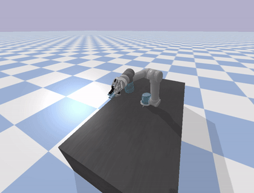
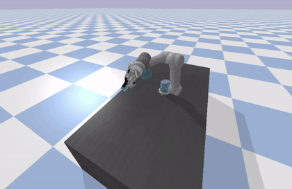
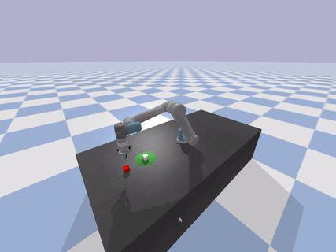
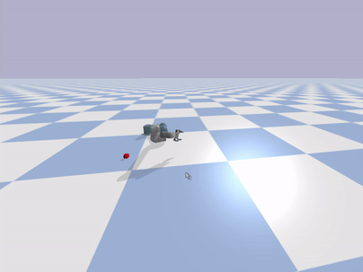
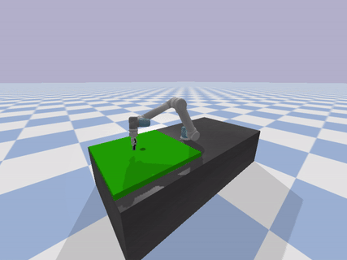
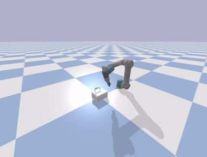

# URGym
Pybullet-based Gymnasium compatible environments for Universal Robot UR5.
Forked from [ElectronicElephant/pybullet_ur5_robotiq](https://github.com/ElectronicElephant/pybullet_ur5_robotiq)

This project provides a collection of Pybullet-based Gymnasium compatible environments for training UR5 robots. Each environment is designed to offer a unique task for reinforcement learning.

Available environments are:

- URGym/BallBalance-v0: balance a ball over a flat surface (like a paddle) attached to the robot gripper.

- URGym/TwoBallsBalance-v0: balance two balls simultanouslly over a flat surface attached to the robot gripper.

- URGym/CubesPush-v0: push a cube with the tip of the gripper to move it closer to a target area.

- URGym/CubesGrasp-v0: grasp a cube with the gripper.

- URGym/Golf-v0: use a golf-like club to move a ball to the target hole.

- URGym/Box-v0: the original environment from [ElectronicElephant/pybullet_ur5_robotiq](https://github.com/ElectronicElephant/pybullet_ur5_robotiq)

Feel free to explore these environments and start training your RL agents!